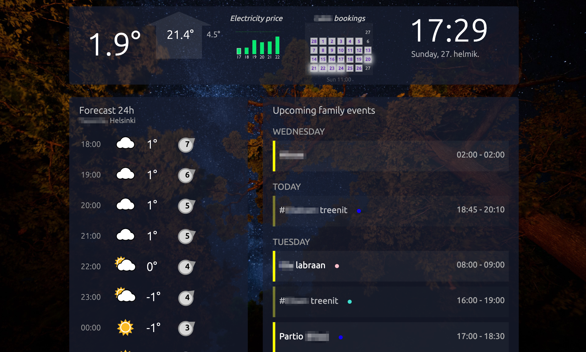

# homeapp73-docker

A home web application, which shows 
- outdoor and indoor climate info
- family calendar from icloud
- booking calendar with booked/unbooked status
- Electricity spot price from Nordpool

The app can be shown on an always-on tablet as web page. The backend can be hosted on various machines, for example on a Raspberry PI.

Example home screen:

# Background

I created the app to try out interesting technologies and make something useful from it. The app has been in daily use for many years as has proven it's value.

Because the target has been to learn and experiment, the app uses a large variety of programming languages and approaches to the problems at hand. It's not the simplest nor the most lightweight. But it still runs without issues on Raspberry PI 4. 

# Getting started 
## Running locally with mockup data
- Install node on your machine (e.g. `brew install node` if you are on Mac and using Brew)
- In the homeclient folder, execute `npm run withmockup` to open the client in development mode using mockup data

Mariadb
- Create docker.env file and set the following environment variables:
    MYSQL_ROOT_PASSWORD={your root password}
    CABIN_USER_PASSWORD={password for cabin user}
Cabinbookings-refresh
- Create .env file and set the following environment variables:
    URL={url to bookign system}
    USERNAME={username to the booking system}
    PASSWORD={password to the bookings system}
    DBUSER={username to the mariadb}
    DBPASSWORD={password to the DBUSER}